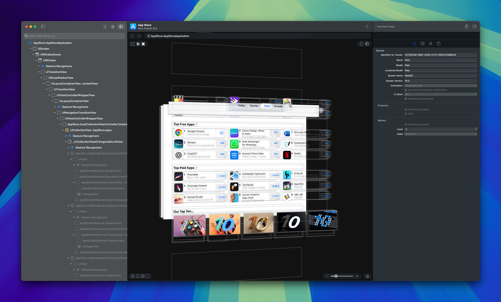
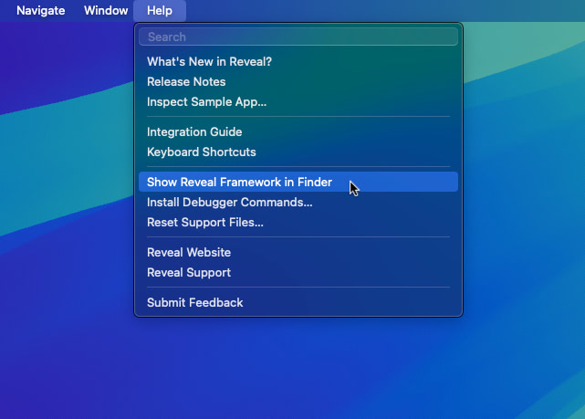
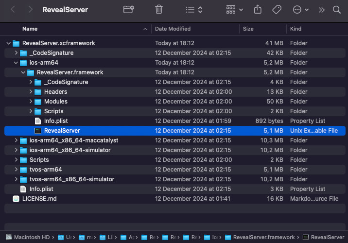
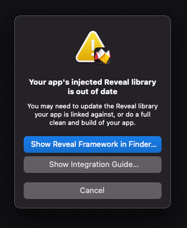
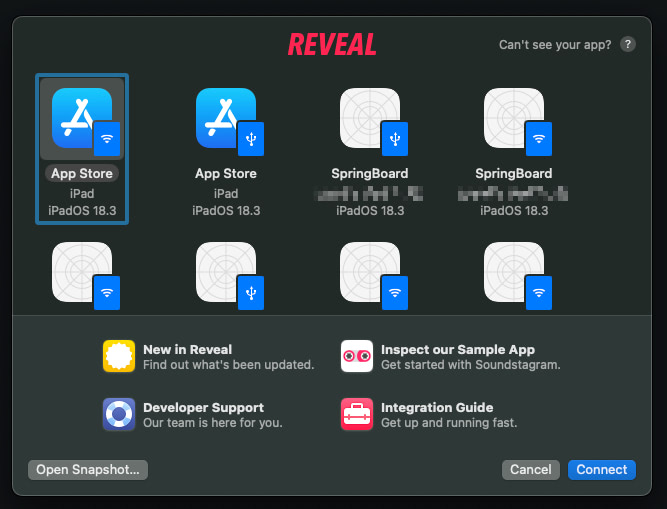

# RevealLoader

RevealLoader is a jailbreak tweak that allows you to load the `RevealServer` binary into iOS applications for UI inspection and debugging purposes using the [Reveal](https://revealapp.com/) app on macOS. This tweak is particularly useful for developers who want to analyze the view hierarchy of iOS apps in real-time.



## Prerequisites
* A [jailbroken iOS device](https://ios.cfw.guide/) (compatible with rootless jailbreaks; confirmed to work on iOS 15 and iOS 18).
* [Theos](https://theos.dev/docs/installation) installed and up-to-date on your Mac.
* [Reveal](https://revealapp.com/) app installed on your Mac.

## Installation

### 1. Clone this Repository

```console
$ git clone https://github.com/imkh/RevealLoader.git
$ cd RevealLoader
```

### 2. Provide the RevealServer binary

RevealLoader is designed to load the `RevealServer` binary into UIKit-based applications. The `RevealServer` binary in this repository is merely a placeholder and is outdated. Always replace it with the version from your installed Reveal app. To do that, launch Reveal and select **Help → Show Reveal Framework in Finder** in the menu bar.



This will open a Finder window containing the `RevealServer` framework.



Copy the `RevealServer` binary from the `ios-arm64` directory into the repository:

```console
$ cp "/Users/[name]/Library/Application Support/Reveal/RevealServer/RevealServer.xcframework/ios-arm64/RevealServer.framework/RevealServer" "./layout/Library/Application Support/RevealLoader/RevealServer"
```

Upon installation of the tweak, the contents of `layout/` will be mapped to `/var/jb/` on your iOS device. This means the binary will be placed at:

```
/var/jb/Library/Application Support/RevealLoader/RevealServer
```

> [!WARNING]  
> If you update the Reveal app on macOS, the `RevealServer` binary may also change. You will need to transfer the updated `RevealServer` binary to your iOS device again; otherwise, Reveal may not be able to connect.



### 3. Build the tweak with Theos

```console
$ make package
```

This will produce a `.deb` package inside a new `packages/` directory.

### 4. Install RevealLoader on your device

Transfer the resulting `.deb` package to your jailbroken iOS device using SSH and install it.

```
$ scp packages/io.imkh.revealloader_0.0.1-1+debug_iphoneos-arm64.deb mobile@<device_ip>:/var/jb/var/mobile
$ ssh mobile@<device_ip>
$ sudo dpkg -i io.imkh.revealloader_0.0.1-1+debug_iphoneos-arm64.deb
```

Verify that the tweak was installed:

```console
$ sudo dpkg -l | grep "io.imkh.revealloader"
ii  io.imkh.revealloader                                  0.0.1-1+debug               iphoneos-arm64 An awesome MobileSubstrate tweak!
```

Verify that the `RevealServer` binary is in place:

```console
$ ls "/var/jb/Library/Application Support/RevealLoader/RevealServer"
```

Respring your device:

```console
$ killall SpringBoard
```

After respringing, your iOS device and any app you open should appear in Reveal, ready to inspect:



## Troubleshooting

### Uninstalling the tweak

To uninstall RevealLoader:

```console
$ sudo dpkg -r io.imkh.revealloader
```

Then respring your device:

```console
$ killall SpringBoard
```

### Checking error logs

If Reveal does not detect your device or app, check for error messages in the system logs. RevealLoader includes basic error handling that logs a message if loading `RevealServer` fails.

1. Open `Console.app` on your Mac.
2. Select your iOS device in the sidebar.
3. Click `Start Streaming`.
4. Open the app you want to inspect on your iOS device.
5. Filter for messages containing: `[RevealLoader]`.

### General checks

* Ensure the `RevealServer` binary is placed at the exact path specified in `init.m`, with executable permissions.
* Restart the target app after placing the binary.
* Respring your device if issues persist.
